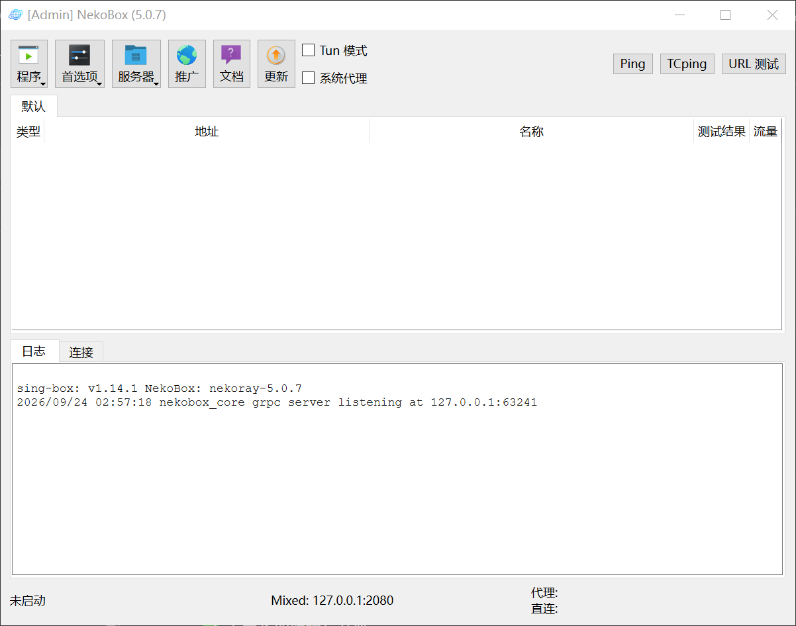

# NekoBox

A modern sing-box GUI client. 单内核 · 稳定优先 · 最小复杂度

[](https://www.gnu.org/licenses/gpl-3.0)
[](https://github.com/lima-droid/sing-box)

## 界面展示



## 简介

NekoBox 是一款独立维护的现代 sing-box GUI 客户端，仅使用 sing-box 单一内核，稳定优先、面向长期维护。

## 特性

- 仅使用 sing-box 单一内核，不捆绑 Xray / v2ray
- 支持 sing-box 主流协议导入、运行、导出
- 客户端内置自动更新，一键升级
- 内置节点测速（Ping / URL 测试）

## 支持协议

全部基于 sing-box 官方 outbound 类型：

- VLESS / VMess / Trojan / Shadowsocks (SS-2022) / TUIC
- Hysteria / Hysteria2 / WireGuard / SSH / NaïveProxy / AnyTLS
- HTTP / HTTPS / SOCKS (4/4a/5)
- Brook（兼容支持）

详细字段支持见 [docs/ProtocolImport.md](docs/ProtocolImport.md)。

## 安装

### Windows

1. 从 [Releases](https://github.com/lima-droid/NekoBox/releases/latest) 下载 `NekoBox-Windows64.zip`
2. 解压后运行 `NekoBox.exe`

若提示缺少运行库，请安装 [微软 C++ 运行库](https://aka.ms/vs/17/release/vc_redist.x64.exe)。

### Linux

- 下载 `NekoBox-Linux-x64.AppImage` 直接运行
- 或下载 `NekoBox-Linux64.tar.gz` 解压运行

Linux 运行教程见 [docs/Run_Linux.md](docs/Run_Linux.md)。

## 使用

1. 导入节点链接或订阅
2. 选择配置档
3. 开启代理（支持 TUN 模式）

## 更新

客户端内置：设置 → 检查更新，自动从 GitHub Releases 获取。

## 构建

```bash
git clone https://github.com/lima-droid/NekoBox
```

推送 tag 后由 GitHub Actions 自动构建并发布。

技术文档见 [docs](https://github.com/lima-droid/NekoBox/tree/main/docs)。

## 讨论群组

加入 Telegram 群组交流反馈: [NekoBox 讨论群](https://t.me/+Kdxyw8yLTz85ODg5)

## License

GPL-3.0
